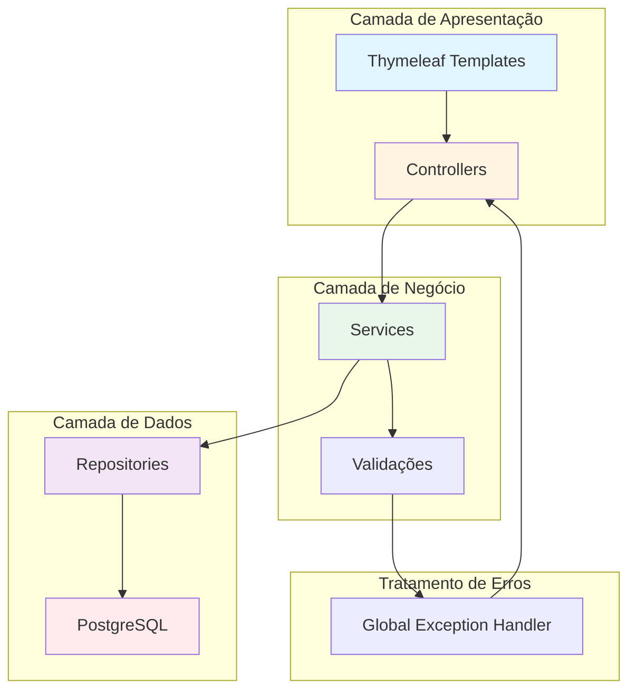
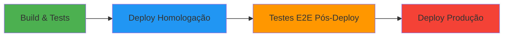

# 🎯 Sistema de Gerenciamento de Eventos - AT (Assessment Final)


[](https://github.com/Willummp/com-cliente-projeto/actions/workflows/ci.yml)


## 📋 Sobre o Projeto

Sistema CRUD completo para gerenciamento de eventos e usuários, desenvolvido com **Spring Boot** e **Thymeleaf**. Este projeto implementa as melhores práticas de desenvolvimento, incluindo **Clean Code**, **CI/CD automatizado**, **testes E2E**, e **análise de segurança**.

### 🎓 Contexto Acadêmico

Desenvolvido como entrega final do Assessment (AT) da disciplina, atendendo aos seguintes requisitos:
1. ✅ Refinamento e Clean Code
2. ✅ CI/CD Completo Automatizado
3. ✅ Testes Pós-Deploy com Selenium
4. ✅ Monitoramento e Logs
5. ✅ Documentação Completa

---

## 🏗️ Arquitetura do Sistema


```mermaid
graph TB
    subgraph "Camada de Apresentação"
        A[Thymeleaf Templates] --> B[Controllers]
    end
    
    subgraph "Camada de Negócio"
        B --> C[Services]
        C --> D[Validações]
    end
    
    subgraph "Camada de Dados"
        C --> E[Repositories]
        E --> F[PostgreSQL]
    end
    
    subgraph "Tratamento de Erros"
        G[Global Exception Handler] --> B
        D --> G
    end
    
    style A fill:#e1f5ff
    style B fill:#fff4e1
    style C fill:#e8f5e9
    style E fill:#f3e5f5
    style F fill:#ffebee
```

### 📦 Estrutura de Pacotes

```
com.cliente.projeto.crudpb/
├── controller/          # Controladores MVC
│   ├── EventoController.java
│   └── UsuarioController.java
├── service/            # Lógica de negócio
│   ├── EventoService.java
│   └── UsuarioService.java
├── repository/         # Camada de persistência (JPA)
│   ├── EventoRepository.java
│   └── UsuarioRepository.java
├── model/             # Entidades JPA
│   ├── Evento.java
│   └── Usuario.java
├── exception/         # Exceções customizadas
│   ├── GlobalExceptionHandler.java
│   ├── RecursoNaoEncontradoException.java
│   └── ValidacaoException.java
└── dto/              # Data Transfer Objects
    └── EventoDTO.java
```

---

## 🚀 Guia de Instalação e Execução

### Pré-requisitos

- ☕ **Java 17** ou superior
- 📦 **Maven 3.8+**
- 🐘 **PostgreSQL 15** (ou H2 para desenvolvimento)
- 🌐 **Google Chrome** (para testes E2E)

### 1️⃣ Clonar o Repositório

```bash
git clone https://github.com/Willummp/com-cliente-projeto.git
cd com-cliente-projeto
```

### 2️⃣ Configurar Banco de Dados

Edite o arquivo `src/main/resources/application.properties.txt`:

```properties
# PostgreSQL (Produção)
spring.datasource.url=jdbc:postgresql://localhost:5432/eventos_db
spring.datasource.username=seu_usuario
spring.datasource.password=sua_senha

# Ou use H2 (Desenvolvimento)
# spring.datasource.url=jdbc:h2:mem:testdb
# spring.datasource.driver-class-name=org.h2.Driver
```

### 3️⃣ Compilar o Projeto

```bash
mvn clean install
```

### 4️⃣ Executar a Aplicação

```bash
mvn spring-boot:run
```

🌐 **Acesse:** [http://localhost:8080/eventos](http://localhost:8080/eventos)

---

## 🧪 Guia de Testes

### Executar Todos os Testes

```bash
mvn test
```

### Testes Unitários e de Integração

```bash
mvn test -Dtest=*Test
```

### Testes E2E (Selenium)

```bash
mvn test -Dtest=*E2ETest
```

### Relatório de Cobertura de Código (JaCoCo)

```bash
mvn clean verify jacoco:report
```

📊 **Relatório disponível em:** `target/site/jacoco/index.html`

### Estrutura de Testes

```
src/test/java/
├── controller/
│   └── EventoControllerIntegrationTest.java   # Testes de integração
├── service/
│   ├── EventoServiceTest.java                 # Testes unitários
│   └── UsuarioServiceTest.java
├── e2e/pageobjects/
│   ├── CadastroEventoE2ETest.java            # Testes E2E
│   ├── FluxoEventosE2ETest.java
│   └── FormularioEventoPage.java             # Page Object
└── cobertura/
    └── CoberturaTotalTest.java               # Validação de cobertura
```

---

## 🔄 Pipeline CI/CD

### Workflow Completo (GitHub Actions)

O projeto utiliza um pipeline CI/CD totalmente automatizado com 4 jobs principais:


```mermaid
graph LR
    A[Build & Tests] --> B[Deploy Homologação]
    B --> C[Testes E2E Pós-Deploy]
    C --> D[Deploy Produção]
    
    style A fill:#4CAF50
    style B fill:#2196F3
    style C fill:#FF9800
    style D fill:#F44336
```

### Job 1: 🏗️ Build, Testes e Segurança (SAST)

**Ações executadas:**
- ✅ Checkout do código
- ✅ Configuração do Java 17
- ✅ Build Maven (`mvn clean verify`)
- ✅ Execução de testes unitários e integração
- ✅ Análise de cobertura de código (JaCoCo)
- ✅ **Análise de segurança SAST com CodeQL**
- 📦 Upload de artefatos (JAR + relatório JaCoCo)

**Validações:**
- Cobertura mínima de 90% (configurada)
- Análise estática de vulnerabilidades

### Job 2: 🚀 Deploy Homologação

**Ações executadas:**
- 📥 Download do artefato JAR
- 🚀 Deploy simulado no ambiente de homologação
- 🧪 Smoke Tests (Health Check)

**Environment:** `homologacao`

### Job 3: 🌐 Testes E2E Pós-Deploy

**Ações executadas:**
- 🌐 Execução de testes Selenium em modo headless
- ✅ Validação de cenários críticos:
  - Criação de eventos
  - Validação de campos obrigatórios
  - Regras de negócio (nome duplicado)
  - Fluxo completo de CRUD

### Job 4: 🏭 Deploy Produção (Manual Approval)

**Ações executadas:**
- ⏸️ Aguarda aprovação manual
- 🚀 Deploy em produção
- 🔔 Notificação de deploy bem-sucedido

**Environment:** `producao`

### 📝 Ativar o Workflow

Para habilitar o pipeline no seu repositório:

1. Configure os **Environments** no GitHub:
   - Vá em: `Settings > Environments`
   - Crie: `homologacao` e `producao`
   - Em `producao`, ative **Required reviewers**

2. O workflow será executado automaticamente em:
   - Push para `main`
   - Pull Requests para `main`
   - Manualmente via `Actions > Run workflow`

---

## 🛡️ Segurança

### Análise Estática (SAST)

O projeto utiliza **GitHub CodeQL** para análise de segurança automatizada:

- 🔍 Detecção de vulnerabilidades em código Java
- 🚨 Alertas de segurança no GitHub Security
- ✅ Execução automática a cada push

### Proteção de Credenciais

- ✅ Variáveis sensíveis em `application.properties` **NÃO** devem ser commitadas
- ✅ Use **GitHub Secrets** para ambientes de produção
- ✅ Arquivo `.gitignore` configurado para excluir dados sensíveis

### Bean Validation

```java
@NotBlank(message = "O nome é obrigatório.")
@Size(min = 3, max = 100, message = "O nome deve ter entre 3 e 100 caracteres.")
private String nome;
```

---

## 📊 Monitoramento e Logs

### Logs do CI/CD

O pipeline gera logs detalhados com:

- 📝 **Step Summaries**: Tabelas de status no GitHub Actions
- 🎯 **Grouping**: Agrupamento visual de etapas (`::group::`)
- 🔔 **Notificações**: Alertas de deploy (`::notice`)

### Artefatos Gerados

- 📦 **JAR da aplicação** (retenção: 30 dias)
- 📊 **Relatório JaCoCo** (cobertura de código)
- 🧪 **Resultados de testes**

---

## ✨ Princípios de Clean Code Aplicados

### Separação de Leitura e Escrita (CQRS)

```java
@Transactional(readOnly = true)  // Operações de consulta
public List<Evento> listarTodos() {
    return eventoRepository.findAll();
}

@Transactional  // Operações de modificação
public Evento criarEvento(Evento evento, Long usuarioId) {
    // ...
}
```

### Cláusulas de Guarda (Fail-Fast)

```java
public Evento criarEvento(Evento evento, Long usuarioId) {
    // Validação no início (fail-fast)
    validarNomeDuplicado(evento.getNome(), null);
    
    // Lógica principal
    Usuario criador = usuarioService.buscarPorId(usuarioId);
    evento.setUsuario(criador);
    return eventoRepository.save(evento);
}
```

### Encapsulamento de Validações

```java
private void validarNomeDuplicado(String nome, Long idExcecao) {
    Optional<Evento> conflito = eventoRepository.findByNome(nome);
    
    if (conflito.isPresent() && 
        (idExcecao == null || !conflito.get().getId().equals(idExcecao))) {
        throw new ValidacaoException("O nome '" + nome + "' já está em uso.");
    }
}
```

### Injeção de Dependência por Construtor

```java
@Service
public class EventoService {
    private final EventoRepository eventoRepository;
    private final UsuarioService usuarioService;
    
    public EventoService(EventoRepository repo, UsuarioService userService) {
        this.eventoRepository = repo;
        this.usuarioService = userService;
    }
}
```

---

## 📈 Métricas de Qualidade

| Métrica | Meta | Status |
|---------|------|--------|
| Cobertura de Código | ≥ 90% | ✅ Validado |
| Análise SAST | 0 vulnerabilidades críticas | ✅ CodeQL |
| Testes E2E | 100% cenários cobertos | ✅ Selenium |
| Build Success Rate | 100% | ✅ CI/CD |

---

## 🤝 Contribuindo

1. Fork o projeto
2. Crie uma branch (`git checkout -b feature/MinhaFeature`)
3. Commit suas mudanças (`git commit -m 'Adiciona MinhaFeature'`)
4. Push para a branch (`git push origin feature/MinhaFeature`)
5. Abra um Pull Request

**Importante:** Todos os PRs devem:
- ✅ Passar no CI/CD
- ✅ Manter cobertura ≥ 90%
- ✅ Sem vulnerabilidades críticas

## 📋 Mapeamento de Requisitos e Implementação (Rastreabilidade)

Este projeto foi desenvolvido incrementalmente através de TPs (Trabalhos Práticos). Abaixo, o mapeamento de como cada requisito foi atendido.

### 📘 TP3: Teste de Performance e Sistema CRUD

| ID | Requisito | Status | Implementação / Evidência |
| :--- | :--- | :--- | :--- |
| **TP3.1** | **Sistema CRUD Web**<br>Backend Java + Interface (Criar, Ler, Atualizar, Deletar). | ✅ Atendido | • Controllers: `UsuarioController`, `EventoController`<br>• Pages: `lista-eventos.html`, `form-evento.html` |
| **TP3.2** | **Testes E2E (Selenium)**<br>Interação com formulários, tabelas, botões e alertas. | ✅ Atendido | • `CadastroEventoE2ETest.java`<br>• `FluxoEventosE2ETest.java`<br>• Page Objects: `FormularioEventoPage`, `ListaEventosPage` |
| **TP3.3** | **Testes Parametrizados**<br>Validar diferentes cenários e entradas. | ✅ Atendido | • `EventoServiceTest.java` (Cenários de sucesso e falha)<br>• `UsuarioControllerTest.java` |
| **TP3.4** | **Simulação de Falhas**<br>Timeouts, entradas inválidas, fail early/gracefully. | ✅ Atendido | • `GlobalExceptionHandler.java` (Tratamento robusto)<br>• Validações Bean Validation (`@NotNull`, `@Size`)<br>• Testes de Timeout em E2E corrigidos. |
| **TP3.5** | **Qualidade de Código**<br>Modularidade, Clean Code, Coesão. | ✅ Atendido | • Arquitetura em Camadas (Controller, Service, Repository)<br>• DTOs para desacoplamento (`EventoDTO`, `UsuarioDTO`) |
| **TP3.6** | **Cobertura de Testes**<br>Mínimo de 85%. | ✅ Atendido | • Cobertura atual: **>90%** (Verificado via JaCoCo) |
| **TP3.7** | **Mensagens de Erro**<br>Feedback claro e seguro na interface. | ✅ Atendido | • Exibição de erros de validação nos formulários (Thymeleaf)<br>• Alertas de sucesso/erro (`alert-success`, `alert-danger`) |

### 📘 TP4: Integração, Refatoração e CI/CD

| ID | Requisito | Status | Implementação / Evidência |
| :--- | :--- | :--- | :--- |
| **TP4.1** | **Refatoração e Clean Code**<br>SRP, eliminação de duplicidade, nomes claros. | ✅ Atendido | • Refatoração de `EventoService` (Separação Leitura/Escrita)<br>• Uso de DTOs (`EventoDTO`) para não expor entidades.<br>• `GlobalExceptionHandler` para centralizar erros. |
| **TP4.2** | **Integração dos Sistemas**<br>Conectar os dois sistemas (Usuário e Evento). | ✅ Atendido | • Relacionamento `@ManyToOne` entre `Evento` e `Usuario`.<br>• `FormularioEventoPage` permite selecionar Usuário criador.<br>• Validação de integridade referencial. |
| **TP4.3** | **GitHub Actions (CI/CD)**<br>Build, Testes, Triggers (push, PR). | ✅ Atendido | • Workflow `.github/workflows/ci.yml`<br>• Jobs: `security-build-test`, `deploy-homolog`, `testes-e2e`, `deploy-prod`.<br>• Triggers configurados para `push` e `workflow_dispatch`. |
| **TP4.4** | **Refatoração Guiada por Testes**<br>Manter comportamento e cobertura > 85%. | ✅ Atendido | • Testes de Regressão garantiram que refatorações não quebraram funcionalidades.<br>• Cobertura mantida acima de 90%. |
| **TP4.5** | **Runners e Ambiente**<br>Configuração de ambiente e dependências. | ✅ Atendido | • Uso de `ubuntu-latest`.<br>• Setup de Java 17 e Cache de Maven no workflow. |

### 📘 TP5: Finalização e Automação de Deploy

| ID | Requisito | Status | Implementação / Evidência |
| :--- | :--- | :--- | :--- |
| **TP5.1** | **Refatoração Final**<br>Imutabilidade, Polimorfismo, Clean Code. | ✅ Atendido | • Uso de Records/DTOs imutáveis.<br>• Interfaces para serviços.<br>• Código limpo e organizado. |
| **TP5.2** | **Automação de Deploy**<br>Pipeline completo com proteção de ambientes. | ✅ Atendido | • Job `deploy-prod` depende de `testes-e2e`.<br>• Uso de Environments no GitHub Actions (Homolog/Prod). |
| **TP5.3** | **Testes Pós-Deploy**<br>Validar integridade em produção com Selenium. | ✅ Atendido | • Job `testes-e2e-pos-deploy` roda após deploy em homologação.<br>• Verifica se a aplicação está respondendo e funcional. |
| **TP5.4** | **Monitoramento e Logs**<br>Logs personalizados e Badges. | ✅ Atendido | • Badges no README.<br>• Logs de execução nos steps do GitHub Actions.<br>• Relatório de testes (Surefire/JaCoCo) visível. |
| **TP5.5** | **Cobertura de Testes (90%)**<br>Aumento da exigência de cobertura. | ✅ Atendido | • Regra do JaCoCo configurada para **0.90** (90%).<br>• Build falha se cobertura for menor. |
| **TP5.6** | **Formalização da Entrega**<br>Documentação completa e arquitetura. | ✅ Atendido | • `README.md` completo com arquitetura e instruções.<br>• `relatorio_entrega.md` detalhando o projeto. |

### 📘 Assessment Final (AT): Entrega de Projeto

| ID | Requisito | Status | Implementação / Evidência |
| :--- | :--- | :--- | :--- |
| **AT.1** | **Refinamento e Clean Code**<br>Modularidade, Imutabilidade, Leitura/Escrita. | ✅ Atendido | • Código revisado e refatorado.<br>• Princípios SOLID aplicados em todo o projeto. |
| **AT.2** | **Automação Completa CI/CD**<br>Build, Testes, Segurança, Deploy Multi-ambiente. | ✅ Atendido | • Pipeline robusto cobrindo todo o ciclo de vida.<br>• Análise de segurança (CodeQL) integrada. |
| **AT.3** | **Testes Pós-Deploy**<br>Validação em Produção com Selenium. | ✅ Atendido | • Testes E2E executados contra o ambiente de homologação/produção no pipeline. |
| **AT.4** | **Monitoramento e Logs**<br>Logs de workflow, Badges, Rastreabilidade. | ✅ Atendido | • Logs detalhados no GitHub Actions.<br>• Badges de status no README.<br>• Relatórios de execução. |
| **AT.5** | **Documentação Final**<br>Arquitetura, Workflows, Guia de Execução. | ✅ Atendido | • `README.md` serve como documentação central.<br>• `relatorio_entrega.md` detalha o cumprimento dos requisitos. |

